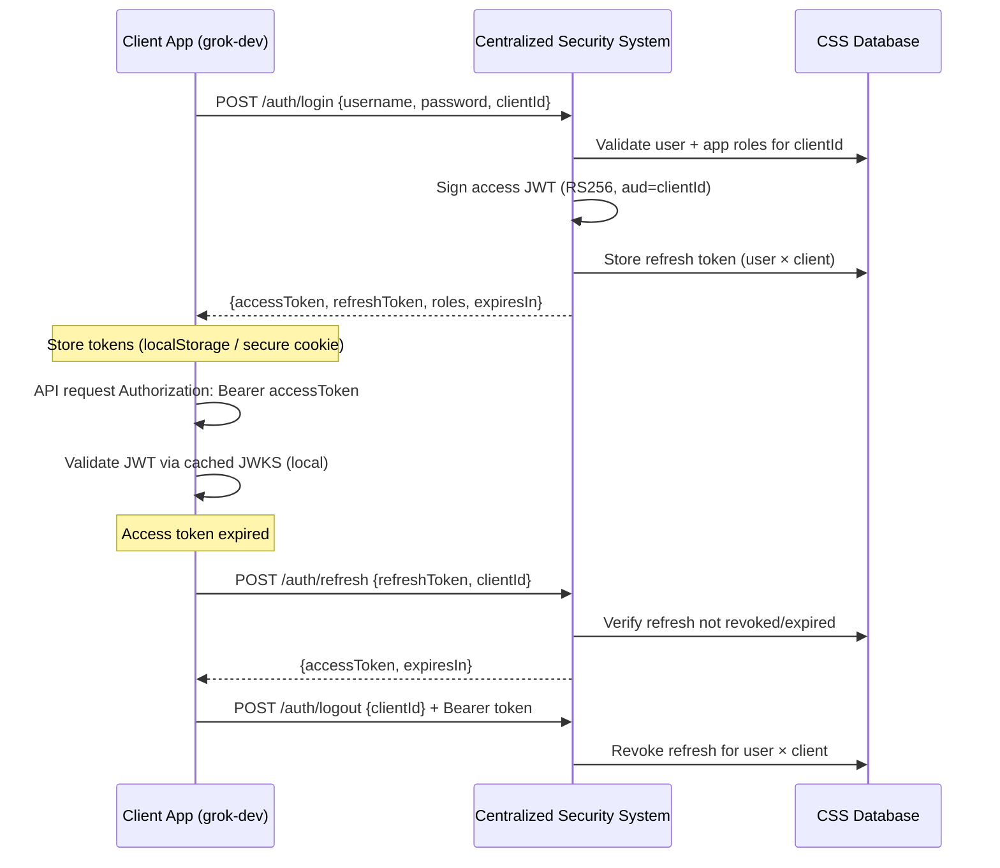

# Architecture — Centralized Security System

## 1. High-Level Design

CSS is an **Identity Provider (IdP)** and **Token Issuer** for multiple resource servers (downstream applications). It does **not** replace application-level authorization (ERPNext DocPerm, grok_dev business rules) — it centralizes **authentication** and **identity claims**.

```
┌─────────────────────────────────────────────────────────────────────────┐
│                     Centralized Security System (:9000)                  │
│  ┌─────────────┐  ┌──────────────────┐  ┌─────────────────────────┐  │
│  │ User Store  │  │ Registered Apps  │  │ Refresh Token Store     │  │
│  │ (users)     │  │ (clientId)       │  │ (per user × client)     │  │
│  └─────────────┘  └──────────────────┘  └─────────────────────────┘  │
│         │                  │                        │                   │
│         └──────────────────┼────────────────────────┘                   │
│                            ▼                                            │
│              AuthenticationService + JwtTokenService (RS256)            │
│                            │                                            │
│              /.well-known/jwks.json  (public key distribution)          │
└────────────────────────────┬────────────────────────────────────────────┘
                             │ Bearer JWT (aud = clientId)
         ┌───────────────────┼───────────────────┐
         ▼                   ▼                   ▼
  ┌─────────────┐    ┌──────────────┐    ┌──────────────┐
  │  grok-dev   │    │ agent-platform│    │ erpnext-bridge│
  │  :8081      │    │  :8080        │    │  (future)     │
  │  Resource   │    │  Resource     │    │  Resource     │
  │  Server     │    │  Server       │    │  Server       │
  └─────────────┘    └──────────────┘    └──────────────┘
```

---

## 2. Comparison with grok_dev Embedded Auth

| Aspect | grok_dev (embedded) | CSS (centralized) |
|--------|---------------------|-------------------|
| Token signing | HS256 symmetric secret | RS256 asymmetric (private sign, public verify) |
| Secret distribution | Same `jwt.secret` on every instance | Apps fetch JWKS — no shared secret |
| User store | `users` table in grok DB | `users` table in CSS DB only |
| Refresh tokens | Per-user opaque UUID in grok DB | Per user **× clientId** in CSS DB |
| Roles | Global Spring Security roles | **Per-application** roles (`user_application_roles`) |
| Login request | `{username, password}` | `{username, password, clientId}` |
| Token claims | `sub`, `exp` | `sub`, `aud`, `client_id`, `roles`, `iss`, `jti` |
| Access TTL | 24 hours | 15 minutes (configurable) |
| Logout scope | Revokes all refresh for user | Revokes refresh for user **+ clientId** |

---

## 3. Authentication Flow



---

## 4. Token Structure

### Access Token (JWT, RS256)

```json
{
  "header": { "alg": "RS256", "kid": "css-key-1" },
  "payload": {
    "iss": "http://localhost:9000",
    "sub": "admin",
    "aud": ["grok-dev"],
    "client_id": "grok-dev",
    "roles": ["ROLE_ADMIN", "ROLE_USER"],
    "jti": "uuid",
    "iat": 1710000000,
    "exp": 1710000900
  }
}
```

### Refresh Token

- Opaque UUID stored server-side
- Bound to `user_id` + `application_id`
- 7-day TTL (configurable)
- Rotated on login (previous refresh for that user×app deleted)

---

## 5. Data Model

```
users
├── id, username, password_hash, email, enabled

registered_applications
├── id, client_id, display_name, enabled

user_application_roles
├── user_id → users
├── application_id → registered_applications
├── role_name (e.g. ROLE_ADMIN)

refresh_tokens
├── token (UUID)
├── user_id, application_id
├── expiry_date, revoked
```

**Key design decision:** Roles are **scoped per application**. A user can be `ROLE_ADMIN` on grok-dev but only `ROLE_USER` on another app — mirroring how ERPNext roles differ from trading platform roles.

---

## 6. Resource Server Validation (Downstream Apps)

Downstream applications **do not call CSS on every request**. They:

1. Fetch JWKS once at startup (cache with TTL)
2. Validate JWT signature locally (RS256 + public key)
3. Verify `iss`, `exp`, and `aud`/`client_id` matches their `clientId`
4. Map `roles` claim to Spring Security authorities

Optional: call `POST /auth/introspect` for opaque validation or when JWKS rotation occurs.

---

## 7. Security Properties

| Property | Implementation |
|----------|----------------|
| Password storage | BCrypt (`PasswordEncoderConfig`) |
| Session state | None (stateless) |
| CSRF | Disabled (token-based API; not cookie-session) |
| CORS | Configurable origin patterns |
| Key management | RS256 key pair; ephemeral in dev, PEM files in prod |
| Token revocation | Refresh token revocation; access tokens expire quickly |
| Multi-tenancy | Application isolation via `clientId` + `aud` claim |

---

## 8. Deployment Topology

### Development (current)

- H2 in-memory database
- Ephemeral RSA keys (regenerated each restart)
- Port 9000

### Production (recommended)

```
┌──────────────┐     ┌──────────────┐     ┌──────────────┐
│   Postgres   │◄────│  CSS (×2)    │────►│  Redis       │
│  (users,     │     │  behind LB   │     │  (JWKS cache)│
│   tokens)    │     └──────────────┘     └──────────────┘
└──────────────┘
        ▲
        │ TLS
   Client apps validate JWT locally
```

- PostgreSQL for user/token persistence
- Persistent RSA keys in secrets manager
- HTTPS only (`css.issuer` must match public URL)
- Short access token TTL (15m) + refresh rotation (future)

---

## 9. What CSS Does NOT Do

- **Authorization within apps** — ERPNext DocPerm, grok_dev market API rules stay in each app
- **User provisioning in downstream DBs** — apps may sync users via webhook (future)
- **Full OIDC/OAuth2 server** — v0.1 implements password + refresh grant patterns; OIDC is roadmap
- **Frappe session bridging** — requires separate `erpnext-bridge` service

---

## 10. Evolution Roadmap

| Phase | Feature |
|-------|---------|
| v0.1 (now) | Multi-app login, JWKS, introspect, seed data |
| v0.2 | `css-spring-boot-starter` resource server auto-config |
| v0.3 | grok_dev migration (remove embedded JwtUtil) |
| v0.4 | agent-platform JWT integration |
| v0.5 | Authorization code flow + PKCE for SPAs |
| v1.0 | OIDC compliant, MFA, audit log, admin UI |

See [migration-guide.md](./migration-guide.md) for grok_dev cutover steps.
